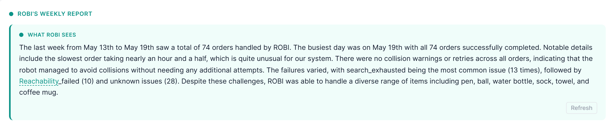

### Fixes at 13:18
1. When it is trying to calculate trajectory (for towel for instance, because it is big), it takes time to go into
handover position, so the robot is standing still. When it stands still, some small messages saying that the robot is trying to find a way
is necessary in order to avoid confusion (looks like the robot is stuck when it is not).
2. No detection for the dropped object, handover continues regardless.
3. Shows that there is a warning, but does not show which step caused warning, e.g., order #33.
4. 'Grippper didn't respond as expected' issue reappears.
5. Time of the "Issues with this cycle" logs is 2 hours behind
6. DO NOT IMPLEMENT YET: A 2D imitation of what the robot is doing physically on the side, instead of having a very big Session Overview.
7. Image sending shuld be fine-tuned as well, it should not send the images during retries, or if it does, at least tag them as such.
8. Add log-line caption at the image (along with AI analysis of course) to give the context of what is happening right now.
9. Wheel is spun is in the colour of the previous state (so if previous order finished in error, it is going to show it in red.)
    1. So is "IDLE, waiting for the next task", it is coloured in red, assuming because Issues with this cycle are red.
10. Hardware fault message is a technical log version shown in UI.
11. Issues with this cycle should not be shown if it is from the previous cycle.
12. An hour and a half session which is not true 
13. "No clear path to hadover the item" is a warning, but shown as in a green "step" in live pipeline.

### Failures
1. No detection/feedback for dropped items
2. Lighthing issues - lighting can affect object detection model, especially anti-stress balls that reflected too much light and had blicks of the spotlights from the ceiling
3. Moving too fast leading to a hardware failure, failure at 13:23 stopped at the coffee mug
4. Dropped the towel again 12:46 -> towel being potentially too heavy, so at the handover when the leverage of the towel is too big against the arm, it goes into emergency stop.
5. Hardware error at 13:39
6. Couldn't detect's at around 13:54-13:57
7. Hardware fault at 13:59
8. Inability to detect decalibration and re-calibrating on its own is the main issue leading to most of the failures -> poorly calibrated camera leads to robot arm moving in according to a shifted coordinate system
9. Misrecognition of the templates in the spinning wheel (this is mostly demo related, but if necessary, implement confirmation of the order by the customer through gestures/sound)
